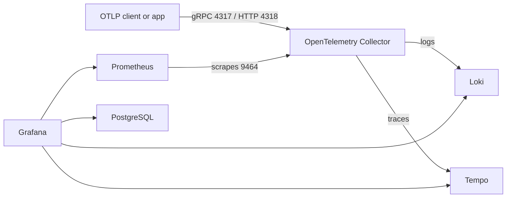

# grafana-otel-example

Minimal local observability stack built with Docker Compose.

It runs Grafana, OpenTelemetry Collector, Prometheus, Loki, Tempo, and PostgreSQL with pre-provisioned Grafana datasources so you can ingest OTLP telemetry and inspect metrics, logs, and traces locally.

The stack uses Docker named volumes so service data is preserved across container restarts and regular `docker compose down` / `docker compose up` cycles.

## Services

- Grafana for dashboards and exploration
- OpenTelemetry Collector as the OTLP ingestion entrypoint
- Prometheus for metrics storage and querying
- Loki for log storage and querying
- Tempo for trace storage and querying
- PostgreSQL as Grafana's application database

## Architecture



The collector accepts OTLP over gRPC on port `4317` and OTLP over HTTP on port `4318`.

Signal routing in this repo:

- traces -> Tempo
- logs -> Loki
- metrics -> Prometheus scrape endpoint exposed by the collector on `9464`

## Quick Start

Prerequisites:

- Docker Desktop or Docker Engine with Compose support

Start the stack:

```sh
docker compose up -d
```

Check status:

```sh
docker compose ps
```

Stop the running containers:

```sh
docker compose stop
```

`docker compose stop` stops the containers without removing them.

Remove containers and network:

```sh
docker compose down
```

`docker compose down` removes the containers and network, but keeps the named volumes and their data.

Remove containers and volumes:

```sh
docker compose down -v
```

Use `docker compose down -v` when you want to delete the persisted data together with the containers.

Recreate after changing Compose or config files:

```sh
docker compose up -d --force-recreate
```

## Local Endpoints

- Grafana: http://localhost:3000
- Prometheus: http://localhost:9090
- Loki HTTP API: http://localhost:3100
- Tempo HTTP API: http://localhost:3200
- OTLP gRPC ingest: localhost:4317
- OTLP HTTP ingest: http://localhost:4318
- Collector health check: http://localhost:13133
- PostgreSQL: localhost:5432

Grafana datasources are provisioned automatically from [config/grafana/provisioning/datasources/datasources.yml](./config/grafana/provisioning/datasources/datasources.yml).

## Sending Telemetry

Point your application or SDK at the collector instead of sending data directly to Grafana backends.

Typical OTLP endpoints:

- gRPC: `http://localhost:4317`
- HTTP: `http://localhost:4318`

Example environment variables for an app using OTLP:

```sh
OTEL_EXPORTER_OTLP_ENDPOINT=http://localhost:4318
OTEL_EXPORTER_OTLP_PROTOCOL=http/protobuf
```

## Configuration Layout

- [docker-compose.yml](./docker-compose.yml): service definitions, ports, environment, and dependencies
- [config/otelcol.yml](./config/otelcol.yml): collector receivers, processors, exporters, and pipelines
- [config/prometheus.yml](./config/prometheus.yml): Prometheus scrape targets
- [config/loki.yml](./config/loki.yml): Loki storage and API settings
- [config/tempo.yml](./config/tempo.yml): Tempo receivers and local storage settings
- [config/grafana/provisioning/datasources/datasources.yml](./config/grafana/provisioning/datasources/datasources.yml): Grafana datasource provisioning

## Operational Notes

- Grafana waits for PostgreSQL health before starting.
- Config files under `config/` are bind-mounted read-only into containers.
- Prometheus, Loki, Tempo, PostgreSQL, and Grafana plugins use named Docker volumes so their data survives normal container recreation.
- If you change service names, ports, or internal endpoints, update every config file that references them.
- For `postgres:18+`, use the parent directory mount layout expected by the image when adding persistent storage.

## Troubleshooting

Inspect one service:

```sh
docker compose logs SERVICE
```

Examples:

```sh
docker compose logs grafana
docker compose logs postgres
docker compose logs otel-collector
```

If Grafana starts but telemetry does not appear:

- confirm the app is exporting to `localhost:4317` or `localhost:4318`
- confirm the collector is up and healthy
- check collector logs for exporter or pipeline errors
- verify Prometheus, Loki, and Tempo are reachable from Grafana

## Scope

This repository only contains the local observability stack. It does not include a sample instrumented application.